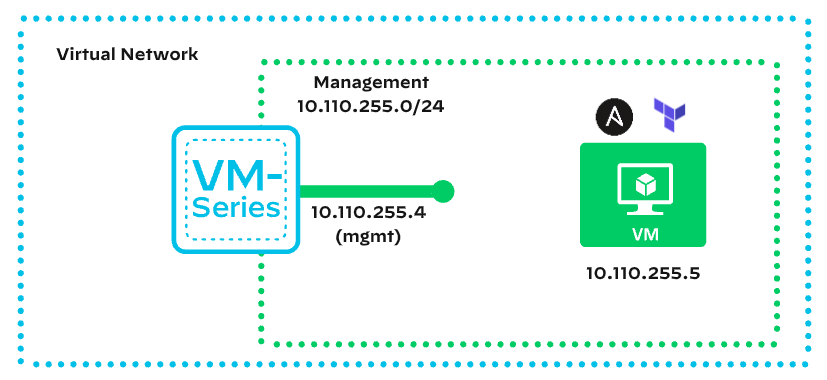

# Palo Alto Networks L100   

L100 is designed to give awareness of the subject matter, with simple hands-on exercises, to enable the learner to feel confident having introductory conversions regarding the topic.

